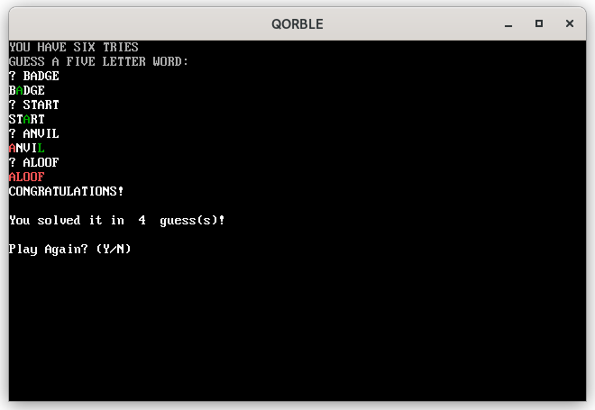

QORBLE
======

A simple word guessing game, written in QBasic ([QB64](https://qb64.com/)), inspired by, but not affiliated with, [Wordle](https://www.powerlanguage.co.uk/wordle/).  

# Build this project

This project can be built with [QB64](https://qb64.com).  Linux users might check out [this COPR repo](https://copr.fedorainfracloud.org/coprs/vwbusguy/qb64/) for a convenient way to install QB64.

To build the project on Linux or MacOS, clone and cd into this repository and run:

`qb64 -x $PWD/qorble.bas -o $PWD/qorble`

Then run it:  `./qorble`

This should also run fine on Windows, but the above command may need adjusted (qb64.exe, etc.). 
